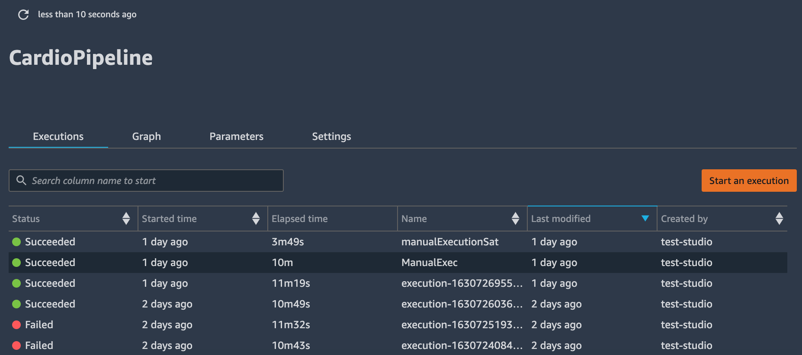
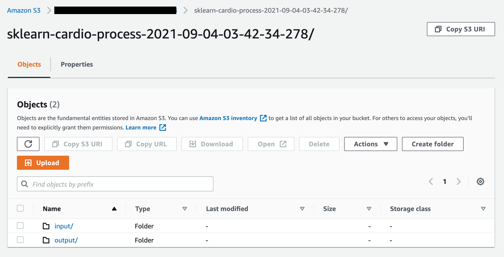

# Technologies Used

## Languages
* Python
	* Pandas
	* SciKitLearn
	* matplotlib
	* Tensorflow

* Javascript
	* GeoJSON

* HTML5

## Data Cleaning and Analysis
* Python - the Pandas library will be used to clen the data and to perform an exploratory analysis.

## Database Storage
* AWS S3 - Raw data files will be stored here before being cleaned.
* PostgreSQL - Database to hold cleaned data and model results.

## Machine Learning
* SciKitLearn - SciKitLearn will be used to split the data into training/testing set. 
* Models - A logistic regression model and a neural network model will be built to compare and predict whether a patient will develop a cardiovascular disease. 

## Dashboard
* Tableau Public - The dashboard will be created using Tableau Public. This dashboard will display geolocation data on chronic diseases in the US. 

## Pipeline
* AWS SageMaker will be used to create a data pipeline. Input and output files will be stored in S3, and a SageMaker pipeline will be created to facilitate the preprocessing, training, modeling steps. Any output files will then be loaded into S3 and/or uploaded straight into the postgreSQL database mentioned above. 
* Pipeline code is currently in the sageMaker folder, with the following steps (Only the CardioProcess step has been integrated.) 

* Currently functionality of the pipeline outputs to S3 only. New functionality to upload data to the postgreSQL database will be added at a later step. 
